<!-- HEADER -->

<h2>💻 Full Stack Developer | UI/UX Learner | Open Source Enthusiast</h2>

---

## 💫 About Me

- 🙋‍♀️ Aspiring Full Stack Developer & Creative Learner  
- 🎯 Skilled in HTML, CSS, JavaScript, Bootstrap  
- 🎨 Currently learning UI/UX (Figma) + React basics  
- 💻 Passionate about building responsive and modern websites  
- 🚀 Actively seeking internships & real-world projects  
- 🎯 Goal: Turn creativity into impactful digital products  

---

## 🌐 Connect with Me

  

  

---

## 💻 Tech Stack

### Programming Languages

### Frontend

### Backend

### Tools & Platforms

### Currently Learning

---

# 📊 GitHub Stats

---

# 🔥 GitHub Activity

 

---
## 🏆 GitHub Trophies

---

## ✨ Quote of the Day

  

---

💙 Thanks for visiting my profile 💙  

